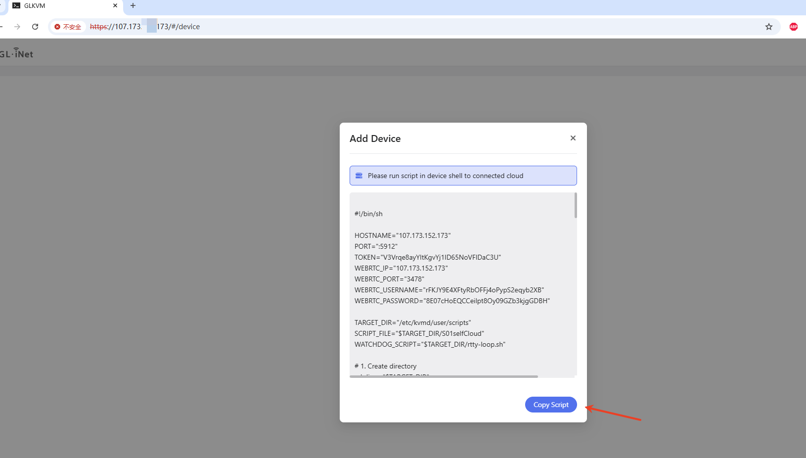
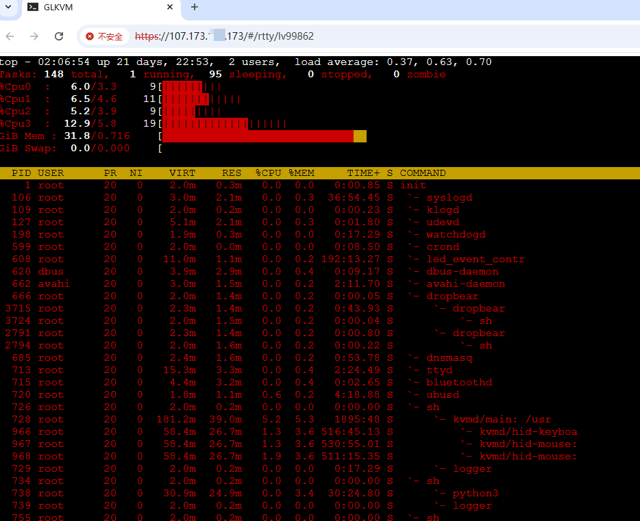

# Self-Deployed Lightweight Cloud KVM Remote Management Platform

[中文文档](./README.zh-CN.md) | English

Self-Deployed Lightweight Cloud is a lightweight KVM remote cloud platform tailored for individuals and small businesses. This project is developed based on [rttys](https://github.com/zhaojh329/rttys), designed for users who need to **quickly** build a remote access platform while prioritizing **data security**. 

#### Main Functions and Features

-  **Device Management** - Online device list monitoring
-  **Script Deployment** - Convenient script-based device addition
-  **Remote SSH** - Web SSH remote connections
-  **Remote Control** - Web remote desktop control
-  **Batch Operations** - Batch command execution capabilities
-  **Rapid Deployment** - Quick self-deployment with simple operations
-  **Data Security** - Private deployment with full data control
-  **Dedicated Bandwidth** - Exclusive bandwidth for self-hosted deployments 
-  **Lightweight Design** - Optimized for small businesses and individual users
-  **Enterprise Authentication** - LDAP login support for enterprise users

## Self-Hosting Guide

The following mainstream operating systems have been tested and verified

#### Debian Family

- Ubuntu 18.04 / 20.04 / 22.04 / 24.04
- Debian 11 / 12

#### Red Hat Family

- AlmaLinux 8 / 9
- Rocky Linux 8 / 9
- CentOS Stream 9

#### Requirements

|      Component      | Minimum Requirement |
| :-----------------: | :-----------------: |
|         CPU         |  1 core or above   |
|       Memory        |       ≥ 1 GB        |
|       Storage       |       ≥ 40 GB       |
| Network Bandwidth   | ≥ 3 Mbps      |
| KVM Device Firmware |      ≥ v1.5.0       |

#### 🔐 Cloud Security Group Settings

If your server provider uses a **cloud security group** (e.g., AWS, Aliyun, etc.), please make sure the following ports are **open**:

**Basic Setup (Self-signed certificates):**

| Port  | Protocol | Purpose                        |
| ----- | -------- | ------------------------------ |
| 443   | TCP      | Web UI access                  |
| 10443 | TCP      | WebSocket proxy                |
| 5912  | TCP      | Device connection              |
| 3478  | TCP/UDP  | TURN server for WebRTC support |

**With Caddy (Automatic HTTPS):**

| Port  | Protocol | Purpose                             |
| ----- | -------- | ----------------------------------- |
| 80    | TCP      | HTTP (auto-redirect to HTTPS)       |
| 443   | TCP/UDP  | HTTPS/HTTP3 for Web UI via Caddy    |
| 5912  | TCP      | Device connection                   |
| 3478  | TCP/UDP  | TURN server for WebRTC support      |

⚠️ **Important:**
- These ports will be **used by GLKVM Cloud**. Please ensure **no other applications or services** on your server are binding to these ports, otherwise the lightweight cloud platform may fail to start properly.
- When using Caddy, port **80 is required** for Let's Encrypt HTTP-01 challenge validation.

------
### 📦 Installation

We provide **two** ways to install GLKVM Cloud: 

#### A) One-line installer (recommended)

> **Note:** The one-line installer is **Docker-based**. It automates Docker/Compose setup, pulls images, renders configs from templates, and starts services for you.

Run **as root**:

```bash
( command -v curl >/dev/null 2>&1 && curl -fsSL https://kvm-cloud.gl-inet.com/selfhost/install.sh || wget -qO- https://kvm-cloud.gl-inet.com/selfhost/install.sh ) | sudo bash
```

#### B) Docker manual install

> Full reference: see [`docker-compose/README.md`](https://github.com/gl-inet/glkvm-cloud/blob/main/docker-compose/README.md)

**Basic Installation (Self-signed Certificate):**
```bash
git clone https://github.com/gl-inet/glkvm-cloud.git
cd glkvm-cloud/docker-compose/
cp .env.example .env
# Edit .env to customize settings
docker-compose up -d
```

**Production Installation (Automatic HTTPS with Caddy):**

For production deployments with automatic Let's Encrypt SSL certificates:

```bash
git clone https://github.com/gl-inet/glkvm-cloud.git
cd glkvm-cloud/docker-compose/
cp .env.example .env
# Edit .env and set DOMAIN and ACME_EMAIL
docker-compose -f docker-compose.yml -f docker-compose.caddy.yml up -d
```

Requirements for automatic HTTPS:
- Domain name pointing to your server IP
- Ports 80 and 443 accessible from internet
- Valid email for Let's Encrypt notifications

See [`docker-compose/README.md`](https://github.com/gl-inet/glkvm-cloud/blob/main/docker-compose/README.md) for detailed configuration options.

### 🌐 Platform Access

Once the installation is complete, access the platform via:

**Without Custom Domain (Self-signed Certificate):**
```
https://<your_server_public_ip>
```

⚠️ **Note**: Accessing via IP address will trigger a **browser certificate warning**.

**With Custom Domain (Automatic HTTPS via Caddy):**
```
https://your-domain.com
```

✅ No certificate warnings with proper Caddy configuration!

### 🔑 Web UI Login Password

The default login password for the Web UI will be displayed in the installation script output:

```
🔐 Please check the installation console for your web login password.
```


## Feature Demonstrations

###  Add KVM Devices to the Lightweight Cloud 

- Copy script



- Run the script in the device terminal


- Devices connected to the cloud


### Remote SSH Connection



### Remote Desktop Control


##  SSL/TLS Certificate Configuration

⚠️ **Note**:

If you just want to **quickly try out GLKVM Cloud** and don't mind the browser's certificate warning,
you can **skip** configuring a custom domain and SSL certificate, and still access the platform via the server's **public IP** with HTTPS (using self-signed certificates).

For production use, you have **two options** for SSL/TLS certificates:

### Option 1: Automatic HTTPS with Caddy (Recommended)

The **easiest and recommended** approach for production deployments:

**Advantages:**
- ✅ Fully automated certificate management (issuance and renewal)
- ✅ Free Let's Encrypt certificates
- ✅ No manual certificate handling
- ✅ Built-in HTTP to HTTPS redirect
- ✅ HTTP/3 support

**Setup:**

1. Configure your domain in `.env`:
   ```bash
   DOMAIN=kvm.example.com
   ACME_EMAIL=admin@example.com
   ```

2. Start with Caddy:
   ```bash
   cd ~/glkvm_cloud
   docker-compose -f docker-compose.yml -f docker-compose.caddy.yml up -d
   ```

3. Access via your domain: `https://kvm.example.com`

See [`docker-compose/README.md`](https://github.com/gl-inet/glkvm-cloud/blob/main/docker-compose/README.md#caddy-setup-automatic-https-with-lets-encrypt) for detailed instructions.

### Option 2: Manual SSL Certificate (Advanced)

For users who prefer to manage their own certificates or need wildcard certificates with custom CA:


#### 🌐 Add DNS Records

To enable full domain-based access, configure the following DNS records for your domain:

```
┌────────────┬──────┬────────────────────┬─────────────────────────────┐
│ Hostname   │ Type │     Value           │         Purpose             │
├────────────┼──────┼────────────────────┼─────────────────────────────┤
│ www        │  A   │ Your public IP      │ Web access to the platform │
│ *          │  A   │ Your public IP      │ Remote access to KVMs      │
└────────────┴──────┴────────────────────┴─────────────────────────────┘
```

#### 🔧 Using a Custom SSL Certificate

To avoid browser warnings, replace the default certificates with your own **wildcard SSL certificate**
 that supports both:

- `*.your-domain.com` (for device access)
- `www.your-domain.com` (for platform access)

Replace the following files in:

```
~/glkvm_cloud/certificate
```

- `glkvm.cer`
- `glkvm.key`

⚠️ **Make sure the filenames remain unchanged.**

#### 🔐 LDAP Authentication Configuration (Optional)

GLKVM Cloud supports LDAP authentication for enterprise environments, allowing you to integrate with existing directory services like Active Directory, OpenLDAP, or FreeIPA.

**Key Features:**
- **Dual Authentication Mode**: Support both LDAP and traditional password authentication simultaneously
- **Group-based Authorization**: Restrict access to specific LDAP groups
- **User-based Authorization**: Allow access for specific users only
- **TLS/SSL Support**: Secure LDAP connections with encryption
- **Multiple LDAP Systems**: Compatible with Active Directory, OpenLDAP, FreeIPA, and generic LDAP servers

**Configuration:**
For detailed LDAP configuration options and setup instructions, see the [Docker Compose README](docker-compose/README.md).

**Note**: When LDAP is enabled, users can choose between:
- **LDAP Authentication**: Enter username and password for directory service authentication
- **Legacy Authentication**: Leave username empty and use the web management password

#### 🔄 Restart Services After Configuration Changes

After replacing certificates or updating LDAP configuration, restart the GLKVM Cloud services to apply the changes:

```bash
cd ~/glkvm_cloud
docker-compose down && docker-compose up -d
```

Or, on systems with the Docker CLI plugin:

```bash
docker compose down && docker compose up -d
```

###  Domain-Based Access Example

Once everything is configured, you can access the platform via your domain:

```
https://www.your-domain.com
```
## Troubleshooting

### Caddy Configuration Issues

**Certificates not being issued:**
1. Verify your domain DNS points to your server's public IP
2. Ensure ports 80 and 443 are accessible from the internet
3. Check Caddy logs: `docker logs glkvm_caddy`
4. Verify DOMAIN and ACME_EMAIL are correctly set in `.env`

**"Error binding to port":**
- Another service is using ports 80 or 443
- Stop the conflicting service or use the basic setup (without Caddy)

**Access denied or connection refused:**
- Check if all containers are running: `docker ps`
- Verify firewall rules allow the required ports
- Check container logs: `docker logs glkvm_cloud`

### General Issues

**Can't access the web interface:**
1. Verify the service is running: `docker ps | grep glkvm`
2. Check if ports are properly exposed: `docker port glkvm_cloud`
3. Review logs: `docker logs glkvm_cloud`

**Device connection fails:**
- Ensure port 5912 is open and accessible
- Verify RTTYS_TOKEN matches between server and device
- Check device logs for connection errors

**WebRTC/video issues:**
- Verify TURN server (coturn) is running: `docker ps | grep coturn`
- Ensure port 3478 (TCP/UDP) is open
- Check coturn logs: `docker logs glkvm_coturn`

For more help, visit: https://github.com/gl-inet/glkvm-cloud/issues
